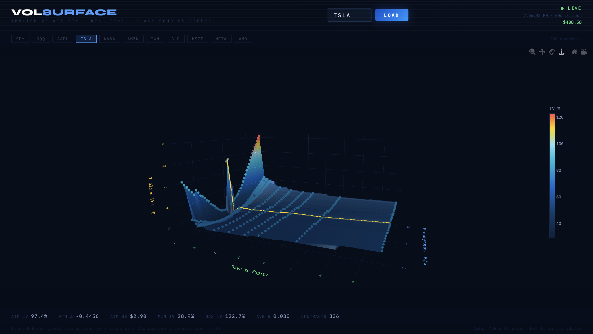

# VolSurface  

Real-time implied volatility surface visualizer with Black-Scholes greeks. Fetches live options chains from Yahoo Finance, computes IV from mid-price quotes, calculates Δ/Γ/ν/Θ for every contract, and renders an interactive 3D surface.



[](https://kylec144.github.io/OptionsVolSurface/)
---

## Features

- **Live options data** — fetches chains via `yfinance` on the server, no CORS issues
- **Mid-price IV solver** — bisection solver from `(bid+ask)/2`, falls back to Yahoo's IV
- **Black-Scholes greeks** — Δ delta, Γ gamma, ν vega, Θ theta (per day) for every contract
- **Scipy linear interpolation** — `LinearNDInterpolator` (Delaunay triangulation) for a smooth, artifact-free surface
- **Smart date sampling** — always includes the nearest 4 expirations (0-3 DTE weeklies) then samples evenly out to 100 days
- **Quote filtering** — drops options with missing prices and extreme IV outliers (3× IQR)
- **Hover tooltips** — click any dot to see strike, expiry, DTE, IV, bid/ask, and all five greeks
- **Auto-refresh** — reloads every 60 seconds
- **Quick-pick tickers** — SPY, QQQ, AAPL, TSLA, NVDA, AMZN, IWM, GLD, MSFT, META

---

## Stack

| Layer | Technology |
|---|---|
| Frontend | React + TypeScript + Vite |
| 3D rendering | Plotly.js (CDN) |
| Backend | Node.js + Express |
| Data & greeks | Python 3 + yfinance + scipy |
| Options math | Custom Black-Scholes (`options.py`) |

---

## Project Structure

```
vol-surface/
├── python_code/
│   ├── GetChainValues.py # Fetches chains, computes greeks, interpolates surface
│   └── options.py        # Black-Scholes call/put pricing and greeks
├── src/
│   ├── App.tsx           # React frontend — surface rendering, tooltips, UI
│   └── main.tsx          # React entry point
├── server.js             # Express API — single /api/options/:ticker endpoint
├── setup.sh              # One-time setup script
├── requirements.txt      # Python dependencies
├── package.json          # Node dependencies
├── vite.config.ts        # Vite dev server with proxy to Express
└── index.html
```

---

## Setup

**Requirements:** Node.js 18+, Python 3.9+

Run once to create the Python venv and install all dependencies:

```bash
chmod +x setup.sh && ./setup.sh
```

This will:
1. Create `venv/` with `yfinance`, `scipy`, and `numpy` installed
2. Run `npm install` for the Node dependencies

---

## Running

**Development** (two terminals):

```bash
# Terminal 1
node server.js

# Terminal 2
npx vite

# Open http://localhost:5173
```

**Development** (one terminal):
```bash
npm run dev

# Open http://localhost:5173
```

**Production:**

```bash
npm run build
npm start        # serves built frontend + API on http://localhost:3000
```

---

## How It Works

### Data pipeline

```
Yahoo Finance
     │
     ▼
GetChainValues.py         <- runs as a subprocess from server.js
  ├── yf.Ticker(ticker)   <- fetch options chain per expiry
  ├── is_bad_quote()      <- drop options with no valid price
  ├── reject_outliers()   <- IQR filter removes extreme IV spikes
  ├── solve_iv()          <- bisection solver from mid-price
  ├── BlackScholesCall/   <- compute Δ, Γ, ν, Θ (per day)
  │   BlackScholesPut
  └── LinearNDInterpolator <- scipy Delaunay triangulation → 50×50 grid
     │
     ▼
server.js /api/options/:ticker
     │
     ▼
App.tsx
  ├── scatter3d           <- raw data points (hover for greeks)
  ├── surface             <- interpolated IV grid
  └── ATM term structure  <- yellow line at moneyness = 1.0
```

### Black-Scholes implementation

`options.py` implements the standard Black-Scholes model:

**Call price:** `C = S·N(d₁) - K·e^(-rT)·N(d₂)`

**Put price:** `P = K·e^(-rT)·N(-d₂) - S·N(-d₁)`

Where:
- `d₁ = [ln(S/K) + (r + σ²/2)·T] / (σ√T)`
- `d₂ = d₁ - σ√T`

Greeks:

| Greek | Formula |
|---|---|
| Δ (delta) | `N(d₁)` for calls, `N(d₁) - 1` for puts |
| Γ (gamma) | `N'(d₁) / (S·σ·√T)` |
| ν (vega) | `S·N'(d₁)·√T` |
| Θ (theta) | `[-S·σ·N'(d₁)/(2√T) - r·K·e^(-rT)·N(±d₂)] / 365` |

Theta is divided by 365 to give **per calendar day** decay.

### IV solving

Yahoo's `impliedVolatility` field is used as a fallback, but the primary IV is solved numerically from the mid-price using bisection over `[0.001, 10.0]` (0.1% – 1000% annualized vol) with 120 iterations to `1e-6` precision.

---

## API

### `GET /api/options/:ticker`

Returns the full options chain with greeks and precomputed interpolation grid.

**Response:**
```json
{
  "spot": 592.34,
  "data": {
    "2026-02-28": {
      "calls": [
        {
          "strike": 590,
          "bid": 3.10,
          "ask": 3.20,
          "lastPrice": 3.15,
          "impliedVolatility": 0.182,
          "volume": 1243,
          "openInterest": 8901,
          "inTheMoney": false,
          "BSprice": 3.14,
          "delta": 0.4821,
          "gamma": 0.0312,
          "vega": 0.8821,
          "theta": -0.0934
        }
      ],
      "puts": [ ... ]
    }
  },
  "surface": {
    "x": [0.75, 0.76, ...],
    "y": [1.2, 4.5, ...],
    "z": [[18.2, 19.1, ...], ...]
  }
}
```

---

## Configuration

| Parameter | Location | Default | Notes |
|---|---|---|---|
| Risk-free rate | `fetch_options.py` | `0.05` (5%) | Change `r = 0.05` |
| Moneyness range | `fetch_options.py` | `0.85 – 1.15` | Strike/spot bounds |
| Max expirations | `fetch_options.py` | 4 near + 12 sampled | Near-term always included |
| Date horizon | `fetch_options.py` | 100 days | `timedelta(days=100)` |
| Grid resolution | `fetch_options.py` | 50 × 50 | Increase for smoother surface |
| Refresh interval | `App.tsx` | 60 seconds | `setInterval(..., 60_000)` |

---

## Caveats

- **Market hours** — outside market hours bid/ask are stale; IV solver falls back to Yahoo's stored IV which may differ from mid-price IV
- **0DTE** — included but theta becomes very large (correct mathematically) as T → 0
- **Not financial advice** — this is a visualization tool, not trading infrastructure
